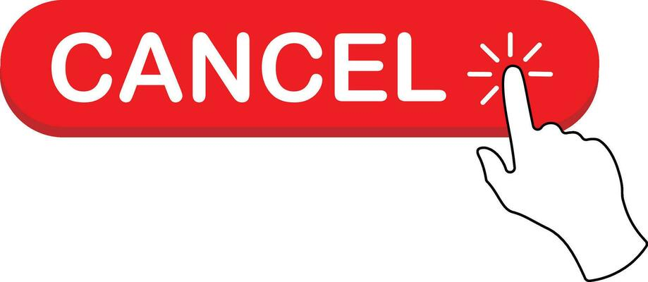

How to Cancel Sling TV Account Without Hassle
-------------------------------------------

.. toctree::
   :maxdepth: 2
   :caption: Contents:

Sling TV has become a go-to choice for many cord-cutters looking to stream live television without the cost of cable. Whether it’s sports, news, or movies, Sling TV offers a flexible lineup of channels. But there might come a time when you decide it’s time to hit pause—or stop altogether. Maybe you're switching services, cutting back on expenses, or just don’t watch much TV anymore. Whatever the reason, the good news is that it’s pretty easy to **cancel sling tv account**—if you know what to do. 😉

  
In this guide, we’ll walk you through how to **sling tv account cancel** without stress or confusion. No tech talk, no complicated steps—just a smooth, simple process. Let’s dive in! 🧘‍♂️📲

🎯 Why You Might Want to Cancel
-------------------------------

Before we get to the how-to, let’s quickly talk about the *why*. Everyone’s reason is different, but here are a few common ones:

- You found another streaming service that better fits your needs
- You're tightening your monthly budget
- You're not watching as much live TV anymore
- You’re taking a break and don’t want to pay during that time

No matter the reason, the process to **cancel sling account** remains the same—simple and user-focused. And remember, canceling doesn’t have to be permanent. You can always come back later. 📆✨

🔑 Know Before You Cancel
-------------------------

Before canceling, log in to your Sling account and check your billing cycle. This helps you know how much time is left before your next charge. When you **sling account cancel**, your access will usually continue through the end of your current paid period. So if you just renewed recently, you can still watch until your plan ends.

Also, canceling stops automatic payments. You won’t be charged again unless you reactivate. It’s a good idea to keep a screenshot or note of your cancellation confirmation just in case. 📝🛑

🧭 Steps to Cancel Sling TV Account
-----------------------------------

Now, onto the main part—how to actually **cancel sling tv account**. Here’s a user-friendly breakdown to get it done quickly:

- Open a browser and go to the Sling TV website.
- Log into your account using your credentials.
- Navigate to your account settings or dashboard.
- Look for an option like *Manage Subscription* or *Cancel Subscription*.
- Follow the prompts to confirm your cancellation.

During the cancellation process, Sling may ask why you’re leaving and offer you a discount or free trial to stay. If you’re sure, just continue the process.

You should receive an email confirmation when the **sling tv account cancel** process is complete. If you don’t, check your spam folder—or log back in to make sure your subscription shows as canceled.

🤔 Having Trouble Cancelling?
-----------------------------

If you run into any issues—like pages not loading, errors, or unclear options—try refreshing your browser or switching to a different one. Sometimes, a quick restart solves the problem.

Still stuck? You can contact Sling TV’s support team for help. They’re usually pretty responsive and can walk you through the **cancel sling account** process step-by-step. 🛠️💬

It’s also worth noting that canceling from the Sling mobile app is not always supported, depending on the platform. It’s best to use a desktop browser for the most reliable experience.

📬 What Happens After Cancellation?
-----------------------------------

Once you **cancel sling tv account**, here’s what to expect:

- You’ll continue to have access until your current billing cycle ends.
- You won’t be billed again unless you manually reactivate.
- Your account information may be saved for a future return.
- You’ll still be able to log in and view some limited content or change settings.

Also, if you used a prepaid gift card or promo offer, those credits usually can’t be refunded. Make sure to use them up before hitting that cancel button. 🎁⏳

🌟 Alternatives to Cancellation
-------------------------------

Still on the fence about canceling? Sling offers a few flexible options you might want to consider before fully committing to **sling account cancel**:

- Pause your subscription for a month or two.
- Switch to a cheaper plan that fits your needs better.
- Remove unnecessary add-ons to lower your bill.

These options might give you a better balance while still enjoying your favorite shows. 📉📺

🎉 Wrapping Up
--------------

Canceling your Sling TV account doesn’t have to be a headache. With just a few clicks and some patience, you can take full control over your subscription without any stress. Whether you're leaving permanently or just taking a break, knowing how to **cancel sling tv account** gives you freedom and flexibility.

So next time someone asks, “How hard is it to **cancel sling account**?” — you can confidently say, “Not hard at all!” 😄✅

Just remember: check your billing date, follow the steps carefully, and save the confirmation. That’s it! Simple, smart, and hassle-free. 🧘‍♀️📱
